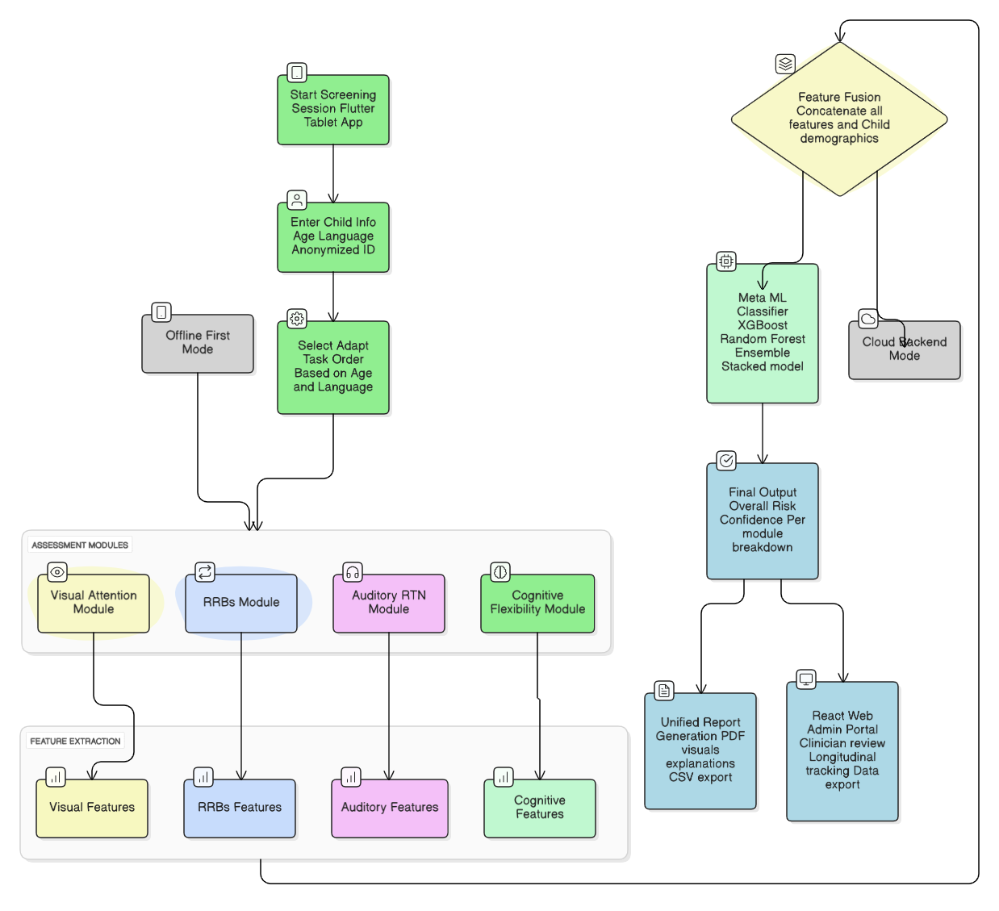

# 🧠 SenseAI – AI-Based Multi-Sensory Autism Screening System

**Project ID:** 25-26J-273
**Degree Program:** BSc (Hons) in Information Technology – SLIIT
**Target Age Group:** 2–6 years
**Platforms:** Android / iOS Tablets · Web Admin Portal
**Project Type:** Final Year Research Project

---

<p align="center">
  [](LICENSE)
  &nbsp;&nbsp;
  [](https://www.sliit.lk/)
  &nbsp;&nbsp;
  [](https://github.com/SamindiS/Autism_Screening_Tool_25-26J-273)
  <br><br>
  [](https://flutter.dev)
  &nbsp;&nbsp;
  [](https://www.python.org/)
  &nbsp;&nbsp;
  [](https://github.com/SamindiS/Autism_Screening_Tool_25-26J-273/commits/main)
  &nbsp;&nbsp;
  [](https://github.com/SamindiS/Autism_Screening_Tool_25-26J-273)
</p>


## 📌 Project Overview

**SenseAI** is a **research-grade, AI-powered early screening system for Autism Spectrum Disorder (ASD)** designed for children aged **2–6 years**.
The system integrates **four clinically motivated behavioral screening components**, each developed independently and collaboratively by team members, into a **single unified platform**.

SenseAI focuses on **objective, child-friendly, culturally adapted, and scalable screening**, particularly suitable for **low-resource healthcare environments in Sri Lanka**.

⚠️ **Disclaimer:** SenseAI is a **screening and research tool only**. It does **not** provide medical diagnosis. All results must be reviewed by qualified healthcare professionals.

---

## 🚨 Problem Statement

Existing ASD screening methods face major limitations:

* Late diagnosis (commonly after age 4)
* High reliance on subjective clinician observation
* Limited access to trained specialists
* Lack of culturally adapted digital tools
* Poor engagement for very young children
* Mostly English-only assessment instruments

These issues delay early intervention and reduce equitable access to screening.

---

## ✅ Proposed Solution

SenseAI addresses these challenges through:

* 🎮 **Gamified, age-appropriate assessments**
* 📊 **Objective behavioral and cognitive metrics**
* 🤖 **Machine-learning-based risk scoring**
* 🌍 **Multilingual support (English, Sinhala, Tamil)**
* 🔌 **Offline-first system architecture**
* 📱 **Tablet-optimized, child-friendly UI**

---

## 🧩 System Components (Collaborative Development)

SenseAI consists of **four integrated screening modules**, each developed in a **separate Git branch** to demonstrate collaboration and independent contribution.

### 🧠 Component 1: Cognitive Flexibility & Rule Switching

**Developer:** Sankalpani M.H.S (IT22128904)

* DCCS (Color–Shape rule switching)
* Go/No-Go inhibitory control
* Reaction time & switch-cost analysis
* ML-based ASD risk classification

---

### 👁️ Component 2: Visual Attention & Gaze Tracking

**Developer:** Karunathilaka S.M

* Camera-based eye-tracking
* Eye Calibration
* Butterfly Chase & Bubble Pop games
* Fixation, saccade & attention metrics
* Gradient Boosting classifier trained on clinical data

---

### 🎧 Component 3: Auditory Response to Name (RTN)

**Developer:** Ilanganthilake I.M.H

* Audio-visual analysis of name-calling response
* Head turn, eye movement & response latency detection
* Non-invasive, home-based screening workflow
* ML-based risk scoring

---

### 🔁 Component 4: Restricted & Repetitive Behaviors (RRBs)

**Developer:** Senavirathna K.G.G.K

* Video-based motor behavior analysis
* Pose estimation + CNN-LSTM deep learning model
* Detection of repetitive movement patterns
* Multi-class RRB classification with confidence scores

---

## 🏗️ Overall System Architecture

```
Flutter Tablet Application
 (Games, Camera, Audio)
        │
        ▼
Node.js Backend (REST API)
 (Authentication, Data Management)
        │
        ▼
ML Services (FastAPI / Flask)
 (Behavior Analysis & Prediction)
        │
        ▼
Web Admin Portal (React)
 (Reports, Analytics, Data Export)
```

---

## 🏗️ Planned Conceptual Model (All 4 Modules Integrated)



## 🧰 Technology Stack & Project Dependencies

### 📱 Mobile Application

* Flutter 3.38+
* Dart 3.x
* SQLite (offline storage)
* Camera & audio access
* ARB-based localization

### ⚙️ Backend Services

* Node.js + Express
* RESTful APIs
* Firebase Firestore (optional)
* SQLite (local persistence)

### 🤖 Machine Learning

* Python (FastAPI / Flask)
* scikit-learn
* TensorFlow / Keras
* XGBoost / Gradient Boosting
* OpenCV, MediaPipe
* joblib

### 🌐 Web Admin Portal

* React 18 + TypeScript
* Vite
* Material-UI (MUI)
* Recharts

---

## 📁 Repository Structure

```
Autism_Screening_Tool_25-26J-273/
│
├── lib/                    # Flutter mobile application
├── senseai_backend/        # Node.js backend
│   ├── ml_engine/          # ML services
├── web_application/        # Admin dashboard
├── assets/                 # Games, images, audio, translations
├── docs/                   # Documentation
├── ML_TRAINING/            # Model training notebooks
└── README.md               # Main project README
```

---

## 🧪 Testing & Validation

* Flutter unit & integration tests
* Backend API testing
* ML model validation
* Cross-component integration testing

---

## 👥 Research Team & Collaboration

| Name                 | Student ID | Component             |
| -------------------- | ---------- | --------------------- |
| Sankalpani M.H.S     | IT22128904 | Cognitive Flexibility |
| Karunathilaka S.M    | IT22921758 | Visual Attention      |
| Ilanganthilake I.M.H | IT22903938 | Auditory RTN          |
| Senavirathna K.G.G.K | IT22568878 | RRB Detection         |

Each component was developed in **individual Git branches**, with **commits, pull requests, and merges** recorded to demonstrate collaborative development.

---

## 🧾 Git Repository & Collaboration Evidence (Checklist 1)

This repository satisfies **Checklist 1** requirements:

* ✅ Central GitHub repository with `README.md`
* ✅ Clearly documented project overview
* ✅ System architecture included
* ✅ Full list of project dependencies
* ✅ Multiple feature branches (one per component)
* ✅ Commit history from all contributors
* ✅ Pull requests and merges into `main` branch

> The Git history demonstrates **team collaboration, independent development, and integration**.

---

## 🔐 Ethics, Privacy & Compliance

* Anonymized child identifiers
* Explicit parent/guardian consent
* No wearable sensors
* Secure data storage
* Research & screening use only

---

## 📄 License

**Research & Academic Use Only**
Not approved for diagnostic or commercial deployment.

---

## 🙌 Acknowledgments

* Sri Lanka Institute of Information Technology (SLIIT)
* Lady Ridgeway Hospital (LRH)
* Research supervisors & clinicians
* Open-source community

---

**Built with ❤️ to support early autism screening and intervention**

*Last Updated: 2026*

---

